# Compte-rendu TP
*Mathilde Rubi*

## Exercice 2 

### Manuel
1.	Which : localiser la commande
2.	Avec man –k mot clé
3.	En appuyant sur q

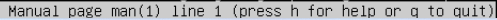
 
4.	 Cette section traite des jeux et petits programmes du système.

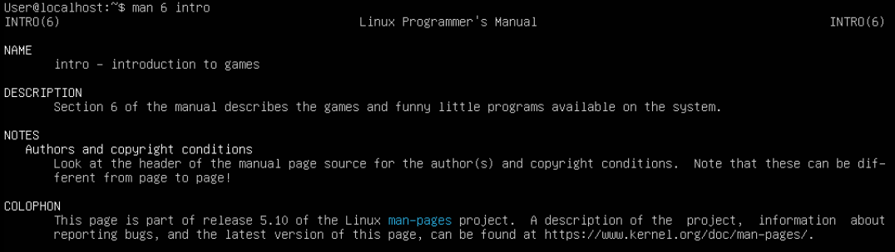
 
 
### Navigation dans l'arborescence des fichiers

1.	 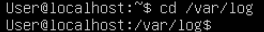
2.	 
3.	 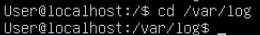
4.	 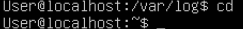
5.	 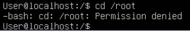
6.	 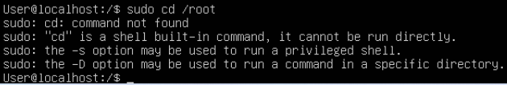
7.	 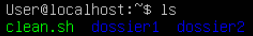
8.	 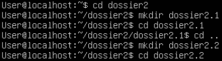
9.	 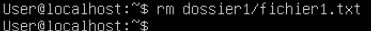
10.	 
11.	 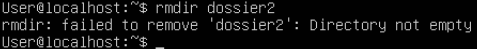
 
8.	Suppression de fichier1
9.	
 
 
Suppression de dossier1

 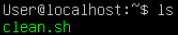

9.	La commande rmdir permet de supprimer un dossier vide

10.	Ne fonctionne pas, le dossier doit être vide
11.	
 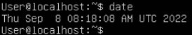
 
11.	Il faut utiliser la commande rm –r ou Rm –rf pour forcer à tout effacer

 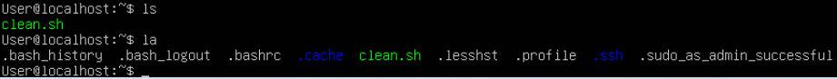
 
 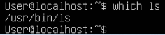
 
Tout est effacé

### Commandes impoirtantes

1.	La commande date permet d’afficher l’heure

 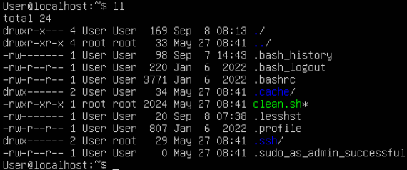
 
La commande time sert à visualiser les temps d’exécution des commandes

2.	 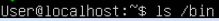

Les fichiers commençant par un point sont des fichiers cachés

3.	Le programme ls se situe dans /usr/bin/ls

  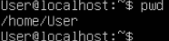
  
  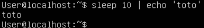
  
4.
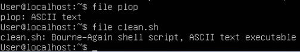

Cette commande affiche les détails des fichiers

5.	 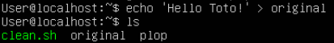

6.	La commande ls .. affiche les dossiers du dossier parent à là où on se situe

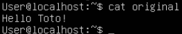

La commande pwd

8.	Ecrit bip dans un fichier plop, l’exécuter plusieurs fois écrase et réécrit le contenu du fichier plop

9.	Ecrit bip dans un fichier plop, l’exécuter plusieurs fois ajoute le texte à la suite du fichier plop

10.	Enlève la saisie pendant 10 secondes, mets le système en pause tout en affichant le texte ‘toto’

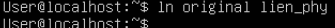
 
11.	 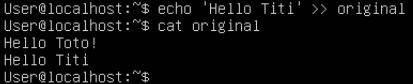

Donne le type de fichier

12.	 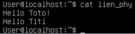

13.	 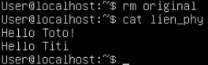


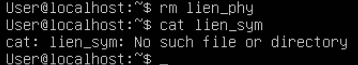

Le contenu de lien_phy est le même que le fichier original

 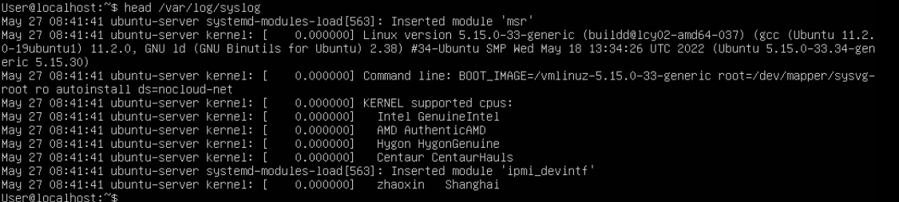
 
Le fichier original n’existe plus mais le contenu de lien_phy est inchangé

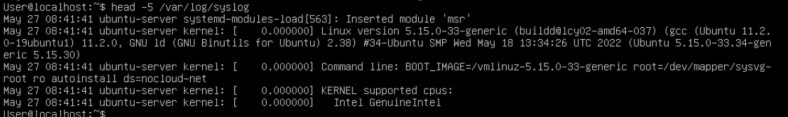

13.	 
Lorsqu’on change le contenu de lien_sym est le même que le contenu de lien_phy.
La même chose pour la situation inverse

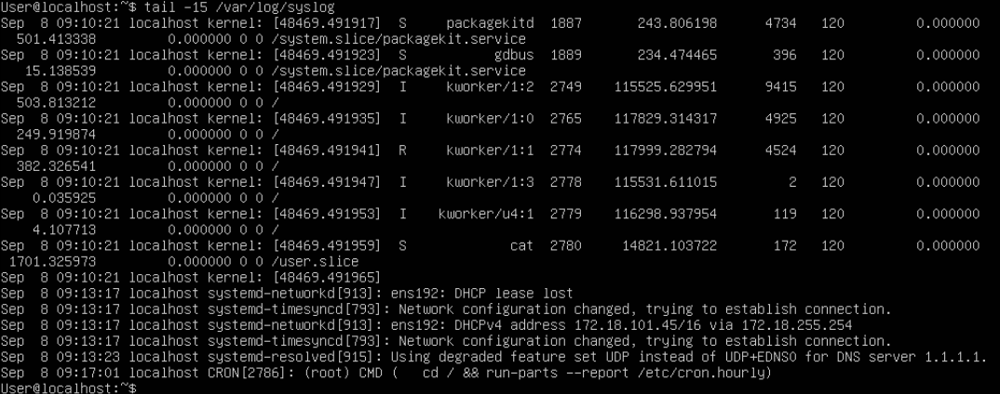

Lorsqu’on supprime lien_phy, lien_sym est aussi supprimé

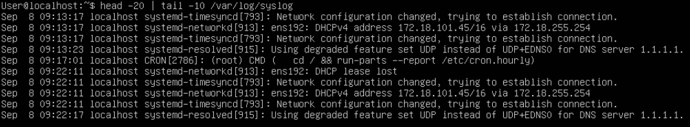

14.	Le raccourci ctrl+s stoppe le défilement, le raccourci ctrl+q reprend le défilement

15.	La commande head affiche les 10 premières lignes

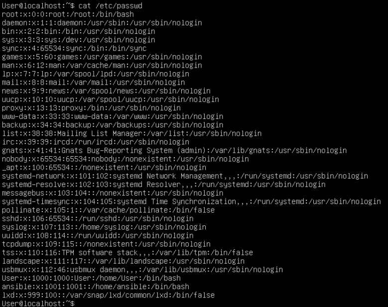
 
 
Sinon spécifier le nb de lignes avec head –n, ici 5

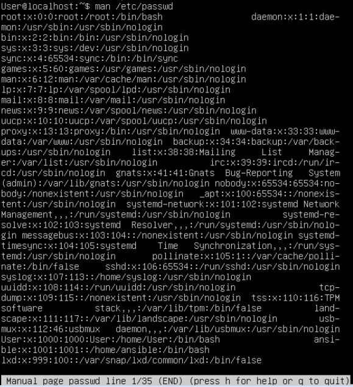

Pour les 15 dernières, utiliser la commande tail -15

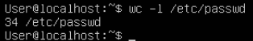

Pour les lignes de 10 à 20 : 


16.
17.  


18. avec la commande sort –k1

19. La commande wc -l 


20. 
21. 
Find –name passwd

22.
```
 echo find –name passwd >>/list_passwd_files.txt 2>>/dev/null
 ```
 
23.
```
grep -R 'll '
```

25. 

## Exercice 3
1.
```
cp /var/log/syslog /home/User
mv syslog log.txt
nano log.txt
```

2.
```
altgr  ctrl 8
kernel noyau a replace all
```

 3.
 
4. alt U Undo
5. ctrl x enregistrer

## Exercice 4 
